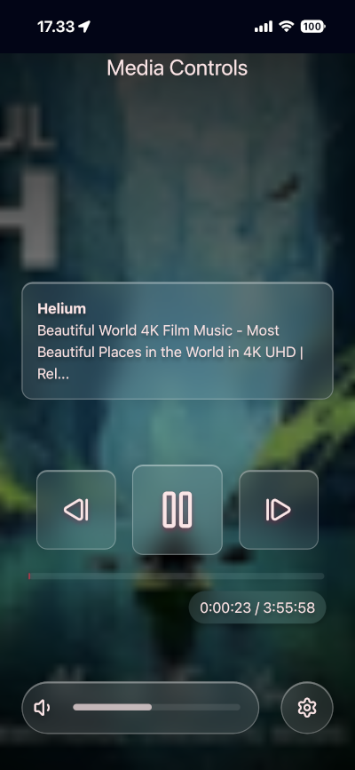
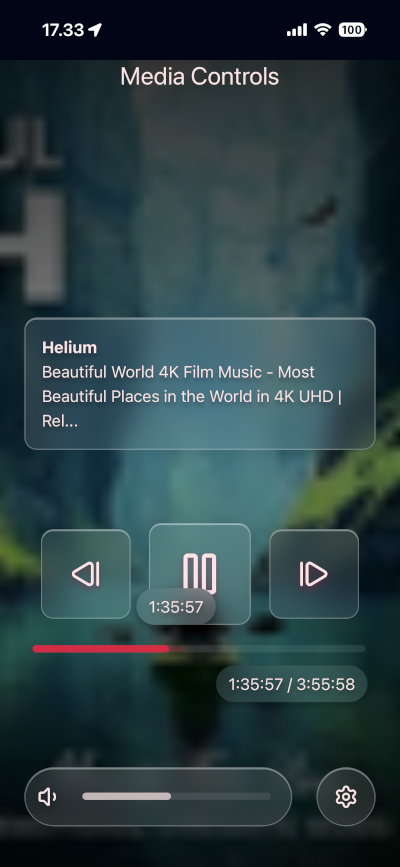

# MPRIS Media Controls

Simple PWA app implementing MPRIS Media Controls for remote controlling media with style.

# Develop

## Pre-requisites

Create `.env` file in the root of `ui` folder with correct server address for the backend.

```bash
VITE_SERVER_ADDRESS=http://wwww
```

## Run

Run dev with following command:

```bash
just dev
```

Run preview version of the app

> [!NOTE]
> Preview mode needs `.env.preview` file with correct `VITE_SERVER_ADDRESS` pointing to correct server.

```bash
just preview
```

## Build and install release app

> [!NOTE]
> Production mode needs `.env.production` file with correct `VITE_SERVER_ADDRESS` pointing to correct server.

Build production app and install it as user systemd service.

```bash
just build produciton
just install
```

# Screenshots

 

# Tour video

https://github.com/user-attachments/assets/7ae00f31-2e1e-48b5-b288-7cd9a2be54e2
